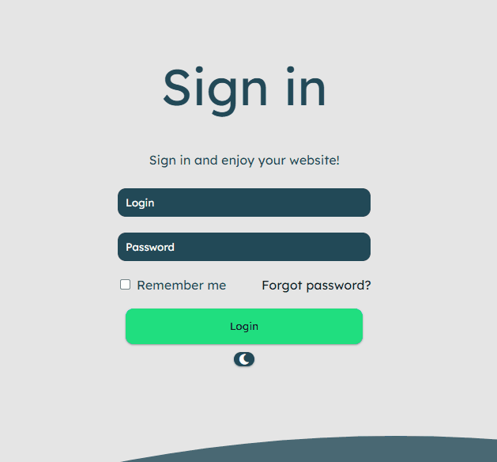

# Sign in Page
<h1 align="center">
    
</h1>

# Descrião
Projeto com intuito de prática e exercitar conceitos de HTML, CSS e JS.
Projeto não possuí validações e apenas versão desktop

# Construído com
 - **HTML - HTML** (Linguagem de Marcação de HiperTexto) é o bloco de construção mais básico da web. Define o significado e a estrutura do conteúdo da web.
 - **CSS - CSS** (Cascading Style Sheets ou Folhas de Estilo em Cascata) é uma linguagem de estilo, utilizada para demonstrar como os elementos da página serão apresentados na tela.

## Status do Projeto
**Concluído:** O projeto esta finalizado

## Autor
- **Desenvolvimento: Leonardo Borges** - Responsável pelo desenvolvimento da página;
